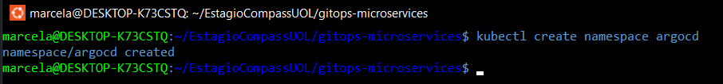
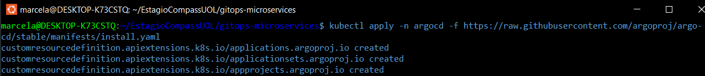
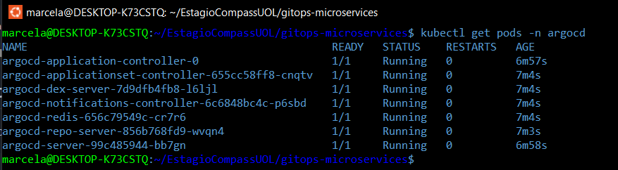
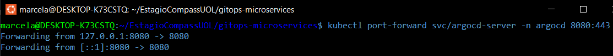
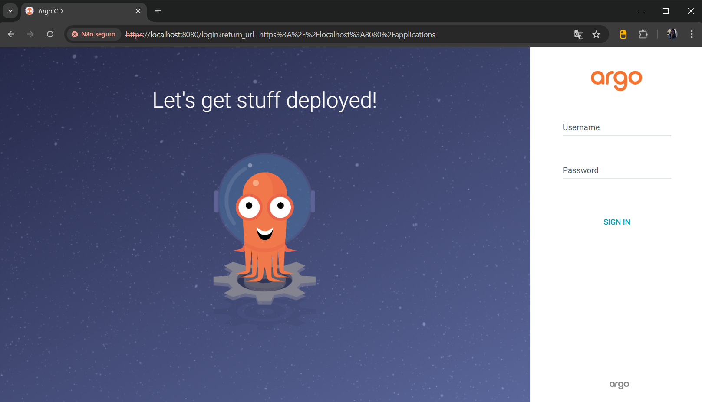
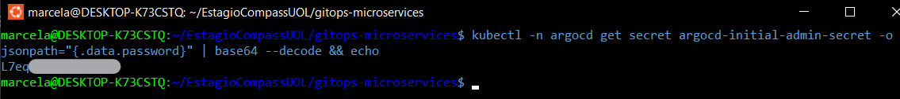
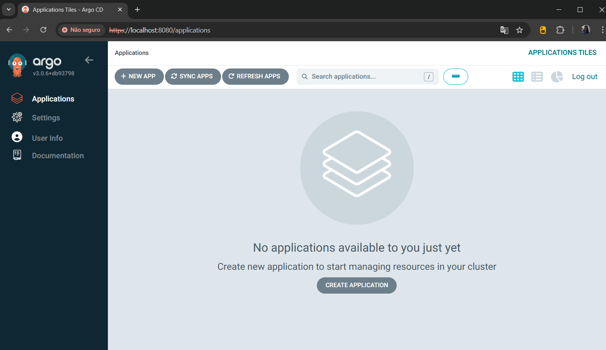

># Projeto GitOps na Prática - PB Compass UOL - ABR 2025 | DevSecOps

## 📝 Descrição do Projeto

Projeto prático de GitOps na trilha de Kubernetes, desenvolvido como parte do Programa de Bolsas da Compass UOL – Abril de 2025 | DevSecOps.

A aplicação Online Boutique foi implantada localmente em um cluster Kubernetes (via Rancher Desktop com WSL2 Ubuntu), utilizando o ArgoCD como ferramenta GitOps para realizar o deploy automatizado da aplicação. O ArgoCD é responsável por sincronizar o estado desejado da aplicação, definido nos manifests YAML versionados no GitHub, com o cluster Kubernetes em tempo real.

---

## 🛠️ Tecnologias Utilizadas


---

## 🔽 Sumário


- [Pré-requisitos](#-pré-requisitos)
- [Etapa 1 – Repositório GitHub](#-etapa-1--repositório-github)
- [Etapa 2 – Instalação do ArgoCD no cluster local](#-etapa-2--instalação-do-argocd-no-cluster-local)
- [Etapa 3 – Acessar o ArgoCD localmente](#-etapa-3--acessar-o-argocd-localmente)
- [Etapa 4 – Criar o App no ArgoCD](#-etapa-4--criar-o-app-no-argocd)
- [Etapa 5 – Acessar o frontend da aplicação](#-etapa-5--acessar-o-frontend-da-aplicação)
- [Etapa Extra – Customização do Manifest](#-etapa-extra--customização-do-manifest)
- [Desenvolvido por:](#-desenvolvido-por)

---

## ➤ Pré-requisitos

- Rancher Desktop instalado e configurado (com Kubernetes habilitado);
- WSL2 com Ubuntu instalado e integrado ao Rancher Desktop;
- Git instalado e configurado localmente;
- GitHub com repositório público criado;
- VS Code (ou outro editor) para edição do arquivo YAML;
- Kubectl instalado e configurado;
- ArgoCD instalado no cluster Kubernetes local.

---

## ➤ Etapa 1 – Repositório GitHub

Foi criado um repositório público no GitHub contendo apenas o arquivo de manifest da aplicação Online Boutique.

O conteúdo foi obtido diretamente do arquivo `kubernetes-manifests.yaml`, disponível no repositório oficial da Google:  
🔗 [https://github.com/GoogleCloudPlatform/microservices-demo/blob/main/release/kubernetes-manifests.yaml](https://github.com/GoogleCloudPlatform/microservices-demo/blob/main/release/kubernetes-manifests.yaml)

Esse conteúdo foi copiado e salvo localmente como `online-boutique.yaml`, dentro do diretório `k8s`, e posteriormente enviado ao repositório `gitops-microservices`.

---

## ➤ Etapa 2 – Instalação do ArgoCD no cluster local

Com o cluster Kubernetes já em funcionamento pelo Rancher Desktop, o ArgoCD será instalado diretamente no cluster local por meio dos comandos abaixo.

### 1. Criar o namespace `argocd`

```bash
kubectl create namespace argocd
```



> Este comando cria um novo namespace exclusivo onde todos os recursos do ArgoCD serão agrupados.

### 2. Aplicar o manifesto oficial de instalação do ArgoCD

```bash
kubectl apply -n argocd -f https://raw.githubusercontent.com/argoproj/argo-cd/stable/manifests/install.yaml
```



> Este comando baixa e aplica o manifesto oficial do ArgoCD, criando os pods, services, deployments e outras configurações necessárias no namespace `argocd`.

### 3. Verificar os pods do ArgoCD em execução

Após a instalação, é possível verificar se os pods foram criados corretamente com o comando abaixo:

```bash
kubectl get pods -n argocd
```



> 🔄 Os pods podem levar alguns segundos ou minutos até que todos fiquem com o status `Running`. Aguarde até que estejam todos prontos antes de seguir para a próxima etapa.

---

## ➤ Etapa 3 – Acessar o ArgoCD localmente

Com o ArgoCD instalado e em execução, é possível acessar sua interface Web localmente utilizando o comando `port-forward`.

### 1. Redirecionar a porta do ArgoCD Server para acesso local

Execute o comando abaixo para expor o ArgoCD Server na porta `8080` da sua máquina:

```bash
kubectl port-forward svc/argocd-server -n argocd 8080:443
```



> Este comando redireciona a porta 443 do serviço `argocd-server` para a porta 8080 da sua máquina local, permitindo o acesso ao painel web via navegador.

### 2. Acessar o painel Web do ArgoCD

Abra o navegador e acesse:

```arduino
https://localhost:8080
```



> Como o ArgoCD utiliza HTTPS por padrão, pode ser necessário aceitar o risco de segurança no navegador ao acessar `localhost`.

### 3. Obter as credenciais de acesso

- Usuário: `admin`

- Senha: execute o comando abaixo para obtê-la:

```bash
kubectl -n argocd get secret argocd-initial-admin-secret -o jsonpath="{.data.password}" | base64 --decode && echo
```



> A senha será exibida no terminal. Use-a para fazer login no painel.



---

## ➤ Etapa 4 – Criar o App no ArgoCD

---

## ➤ Etapa 5 – Acessar o frontend da aplicação

---

## ➤ Etapa Extra – Customização do Manifest

---

## 👩‍💻 Desenvolvido por:

<table>
  <tr>
    <td align="center">
      <a href="https://github.com/MarcelaLinhares">
        <br />
        <sub><b>Marcela Linhares</b></sub>
      </a>
    </td>
  </tr>
</table>

---