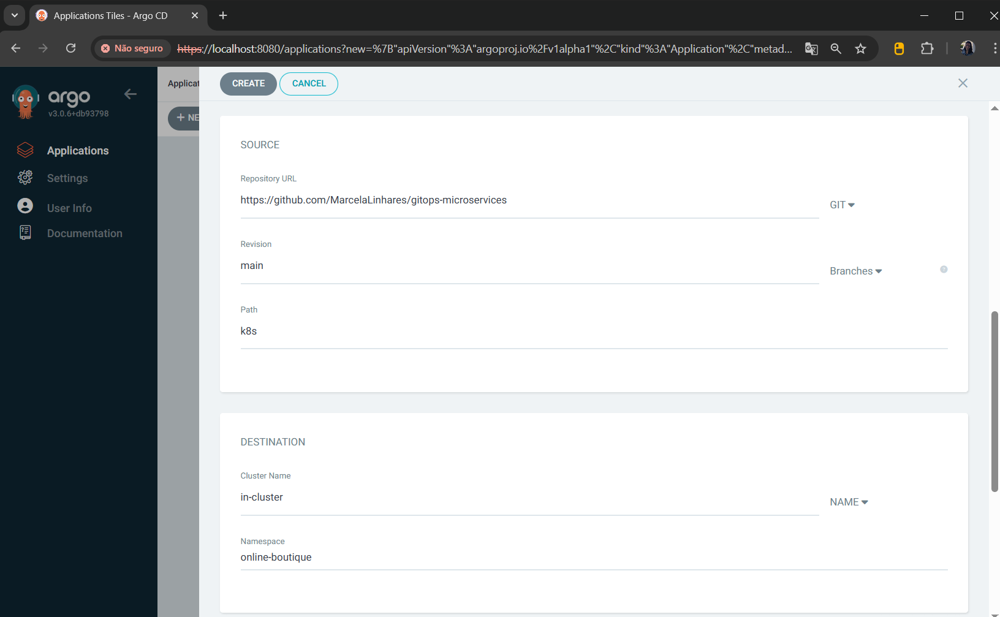
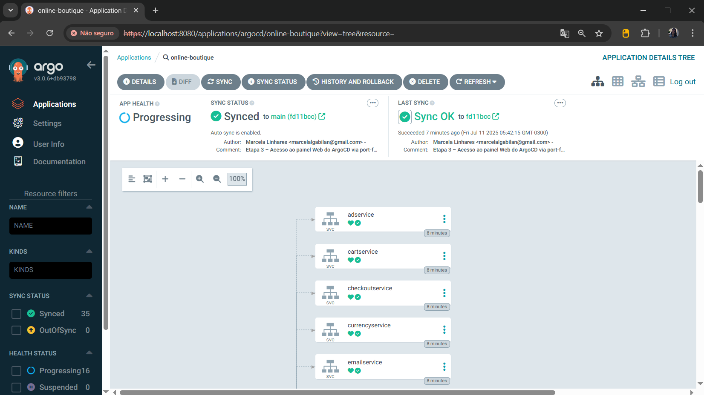
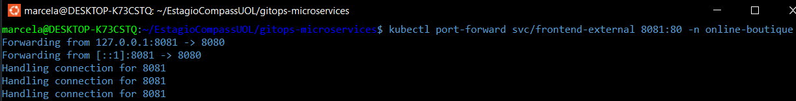

># Projeto GitOps na Prática - PB Compass UOL - ABR 2025 | DevSecOps

## 📝 Descrição do Projeto

Projeto prático de GitOps na trilha de Kubernetes, desenvolvido como parte do Programa de Bolsas da Compass UOL – Abril de 2025 | DevSecOps.

A aplicação Online Boutique foi implantada localmente em um cluster Kubernetes (via Rancher Desktop com WSL2 Ubuntu), utilizando o ArgoCD como ferramenta GitOps para realizar o deploy automatizado da aplicação. O ArgoCD é responsável por sincronizar o estado desejado da aplicação, definido nos manifests YAML versionados no GitHub, com o cluster Kubernetes em tempo real.

---

## 🛠️ Tecnologias Utilizadas


---

## 🔽 Sumário


- [Pré-requisitos](#-pré-requisitos)
- [Etapa 1 – Repositório GitHub](#-etapa-1--repositório-github)
- [Etapa 2 – Instalação do ArgoCD no cluster local](#-etapa-2--instalação-do-argocd-no-cluster-local)
- [Etapa 3 – Acessar o ArgoCD localmente](#-etapa-3--acessar-o-argocd-localmente)
- [Etapa 4 – Criar o App no ArgoCD](#-etapa-4--criar-o-app-no-argocd)
- [Etapa 5 – Acessar o frontend da aplicação](#-etapa-5--acessar-o-frontend-da-aplicação)
- [Etapa Extra – Customização do Manifest](#-etapa-extra--customização-do-manifest)
- [Desenvolvido por:](#-desenvolvido-por)

---

## ➤ Pré-requisitos

- Rancher Desktop instalado e configurado (com Kubernetes habilitado);
- WSL2 com Ubuntu instalado e integrado ao Rancher Desktop;
- Git instalado e configurado localmente;
- GitHub com repositório público criado;
- VS Code (ou outro editor) para edição do arquivo YAML;
- Kubectl instalado e configurado;
- ArgoCD instalado no cluster Kubernetes local.

---

## ➤ Etapa 1 – Repositório GitHub

Foi criado um repositório público no GitHub contendo apenas o arquivo de manifest da aplicação Online Boutique.

O conteúdo foi obtido diretamente do arquivo `kubernetes-manifests.yaml`, disponível no repositório oficial da Google:  
🔗 [https://github.com/GoogleCloudPlatform/microservices-demo/blob/main/release/kubernetes-manifests.yaml](https://github.com/GoogleCloudPlatform/microservices-demo/blob/main/release/kubernetes-manifests.yaml)

Esse conteúdo foi copiado e salvo localmente como `online-boutique.yaml`, dentro do diretório `k8s`, e posteriormente enviado ao repositório `gitops-microservices`.

---

## ➤ Etapa 2 – Instalação do ArgoCD no cluster local

Com o cluster Kubernetes já em funcionamento pelo Rancher Desktop, o ArgoCD será instalado diretamente no cluster local por meio dos comandos abaixo.

### 1. Criar o namespace `argocd`

```bash
kubectl create namespace argocd
```


> Este comando cria um novo namespace exclusivo onde todos os recursos do ArgoCD serão agrupados.

### 2. Aplicar o manifesto oficial de instalação do ArgoCD

```bash
kubectl apply -n argocd -f https://raw.githubusercontent.com/argoproj/argo-cd/stable/manifests/install.yaml
```


> Este comando baixa e aplica o manifesto oficial do ArgoCD, criando os pods, services, deployments e outras configurações necessárias no namespace `argocd`.

### 3. Verificar os pods do ArgoCD em execução

Após a instalação, é possível verificar se os pods foram criados corretamente com o comando abaixo:

```bash
kubectl get pods -n argocd
```


> 🔄 Os pods podem levar alguns segundos ou minutos até que todos fiquem com o status `Running`. Aguarde até que estejam todos prontos antes de seguir para a próxima etapa.

---

## ➤ Etapa 3 – Acessar o ArgoCD localmente

Com o ArgoCD instalado e em execução, é possível acessar sua interface Web localmente utilizando o comando `port-forward`.

### 1. Redirecionar a porta do ArgoCD Server para acesso local

Execute o comando abaixo para expor o ArgoCD Server na porta `8080` da sua máquina:

```bash
kubectl port-forward svc/argocd-server -n argocd 8080:443
```


> Este comando redireciona a porta 443 do serviço `argocd-server` para a porta 8080 da sua máquina local, permitindo o acesso ao painel web via navegador.

### 2. Acessar o painel Web do ArgoCD

Abra o navegador e acesse:

```arduino
https://localhost:8080
```


> Como o ArgoCD utiliza HTTPS por padrão, pode ser necessário aceitar o risco de segurança no navegador ao acessar `localhost`.

### 3. Obter as credenciais de acesso

- Usuário: `admin`

- Senha: execute o comando abaixo para obtê-la:

```bash
kubectl -n argocd get secret argocd-initial-admin-secret -o jsonpath="{.data.password}" | base64 --decode && echo
```


> A senha será exibida no terminal. Use-a para fazer login no painel.


---

## ➤ Etapa 4 – Criar o App no ArgoCD

Com acesso ao painel do ArgoCD, será criado um novo aplicativo que permitirá que o ArgoCD gerencie e sincronize os manifestos da aplicação Online Boutique com o cluster Kubernetes local.


### 1. Criar um novo App

Na interface do ArgoCD:

1. Clique em **"Applications"** no menu lateral
2. Em seguida, clique em **"+ NEW APP"** no canto superior direito

Preencha os campos do formulário da seguinte forma:

| Campo                 | Valor                                                                 |
|-----------------------|------------------------------------------------------------------------|
| **Application Name**  | `online-boutique`                                                      |
| **Project**           | `default`                                                              |
| **Sync Policy**       | Selecione **Automatic**                                                |
|                       | Marque as opções: `Prune Resources`, `Self Heal`, `Set Deletion Finalizer`, `Auto-Create Namespace` |
| **Repository URL**    | `https://github.com/MarcelaLinhares/gitops-microservices` *(ou o seu)* |
| **Revision**          | `main`                                                                 |
| **Path**              | `k8s` *(sem ./ ou caminho completo)*                                   |
| **Cluster URL**       | Clique em `NAME` e selecione: `in-cluster`                             |
| **Namespace**         | `online-boutique` *(novo namespace que será criado automaticamente)*   |

> Clique em **"Create"** para finalizar a criação do aplicativo.




### 2. Confirmar criação do App

O ArgoCD tentará sincronizar os manifests presentes no diretório `k8s/` do seu repositório público com o cluster local.  
Se tudo estiver correto, os microserviços da Online Boutique começarão a ser criados automaticamente.




---

## ➤ Etapa 5 – Acessar o frontend da aplicação

Com os pods em execução e o aplicativo `online-boutique` sincronizado, o próximo passo é acessar o frontend da aplicação.

### 1. Redirecionar a porta do serviço `frontend-external`

Execute o comando abaixo em um terminal para fazer o redirecionamento de portas com `port-forward`, e expor a aplicação frontend na porta `8081` da sua máquina local::

```bash
kubectl port-forward svc/frontend-external 8081:80 -n online-boutique
```



> Este comando redireciona a porta `80` do serviço `frontend-external` no cluster para a porta `8081` da sua máquina local, permitindo o acesso via navegador.

### 2. Acessar a aplicação no navegador

Com o port-forward ativo, abra o navegador e acesse:

```arduino
http://localhost:8081
```

> 💡 Caso esteja utilizando o WSL2, o navegador no Windows também poderá acessar o endereço normalmente.

> ✅ Se o pod frontend estiver com STATUS = Running, a aplicação será carregada corretamente. 

---

## ➤ Etapa Extra – Customização do Manifest

---

## 👩‍💻 Desenvolvido por:

<table>
  <tr>
    <td align="center">
      <a href="https://github.com/MarcelaLinhares">
        <br />
        <sub><b>Marcela Linhares</b></sub>
      </a>
    </td>
  </tr>
</table>

---